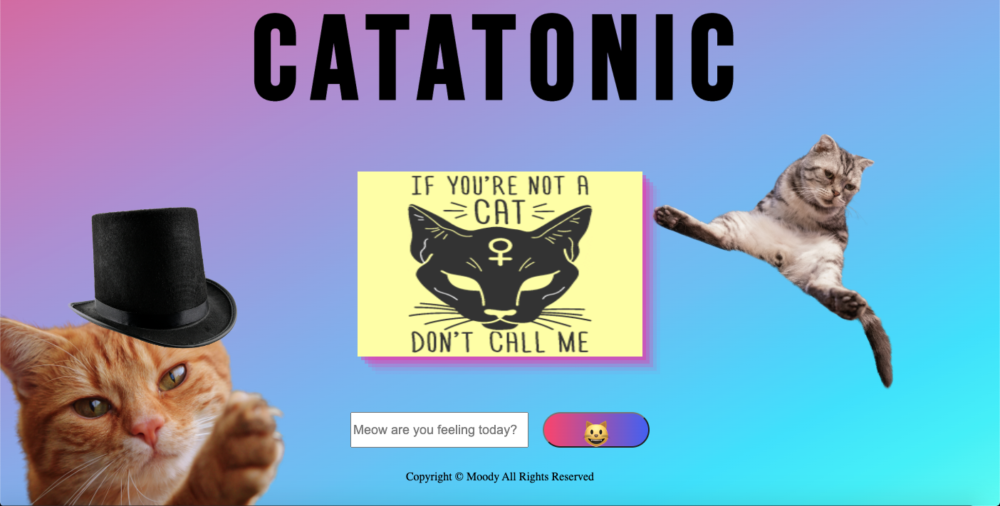

A Javascript app that allows users to have their current mood displayed by a cat meme by using the Giphy API.

**To check out the app, click <a href="https://mood-cat.netlify.app" target="_blank">here</a>**

## Technologies Used

1. HTML
2. CSS
3. JavaScript/jQuery
