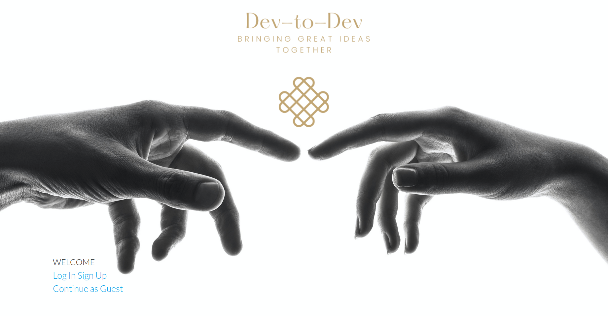

Dev-to-Dev is a Django based app that allows users, specifically bootcamp students, to browse software development topics of interests and have discussions with other bootcamp students or developers from all over the world.

**To check out the app, click <a href="https://dc-dev-to-dev-test.herokuapp.com/" target="_blank">here</a>**

## Technologies Used

1. HTML, CSS, Javascript
2. Materialize CSS
3. JQuery
4. Python
5. Django
6. PostgreSql
7. Herkoku