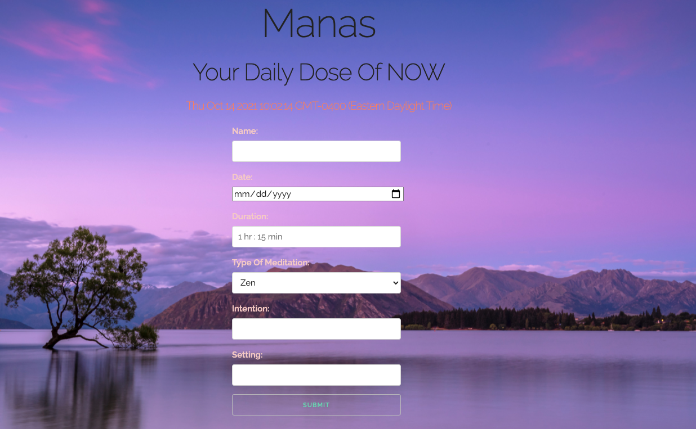

Allows user to track meditation and mindfulness practice. Provides fields for intention, setting, duration, date, and type of meditation.

**To check out the app, click <a href="https://mindfulnessapp.herokuapp.com/" target="_blank">here</a>**
 
<a href="https://github.com/APareja12/mindfulness-app" target="_blank">Github</a>

## Technologies Used

1. HTML, CSS, JavaScript/jQuery
2. Mongoose
3. MongoDB
4. Heroku
5. Node JS
6. Express
